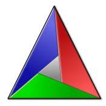

# aWareHouse Projekt
   

## Szoftver célja
A szoftver keretében egy Amazon-stílusú automatizált raktár szimulációját valósítjuk meg, melyben a felhasználó megadhatja - akár külön szerkesztő segítségével - egy raktár elrendezését (a benne lévő állványok, célállomások, robotok, töltőállomások megadásával), majd a szimuláció elindításával, egy lehetséges végrehajtását láthatja a termékek kiszállításának, amit a robotok végeznek a polcok, illetve a célállomások közötti mozgással. 

A szimuláció végrehajtása után, a felhasználó megtekintheti az adott szimulációnak a statisztikáit: mennyi energiát fogyasztottak a robotok, mennyi lépésből sikerült elvégezni a feladatot, mennyi idő volt a szimuláció. A program a lehetőséget ad a szimuláció többszöri futtatására, esetleges leállítására és a lejátszási sebesség állítására.

A szimulációt nehezíti, hogy a robotoknak töltöttségi szintje van. Minden akciójuk - legyen az lépés, forgás, állvány felvétel - meríti az akkumulátort, ezért a termékek kiszállítása közben figyelni kell arra, hogy elég legyen a töltöttsége az adott robotnak ahhoz, hogy a feladatát befejezze. Ha nem elég a töltöttségi szintje, akkor töltenie kell magát az egyik, szabadon lévő töltőállomáson.

A szimuláció végrehajtása során, a felhasználónak lehetősége nyílik újabb megrendelések felvételére dinamikusan, amelyeket a robotoknak szintén el kell szállítania a célállomásokhoz.

A szoftver a felhasználóinak lehetőséget nyújt különböző algoritmusok kipróbálására, tesztelni azok effektivitását megadott környezetben. A változtatható környezet miatt a szimuláció segítségül szolgálhat egy raktározó/kiszállító cégnek, hogy milyen paraméterek mellett lenne a legproduktívabb a munkafolyamat a valóságban és a különböző végrehajtásokat könnyű összehasonlítani a statisztika meglétével.

A program megvalósításában több, manapság egyre népszerűbb és bonyolultabb problémákra próbálunk egyfajta választ adni. A szoftverben a következő problémákra keresünk megoldásokat: 
- a legrövidebb utak megtalálása adott paraméterek mellett
- konfliktuskezelés két/több résztvevő között
- megfelelő ütemezés
- több szimuláció futtatása egy időben
- különböző típusú robotok általi feladat végrehajtás.
 
## Feladatleírás
* [Feladatleírás pdf](./readme-src/feladatleiras.pdf)

## Készítette

* [Bodó József](https://szofttech.inf.elte.hu/i7p4uq)
* [Deák Árpád](https://szofttech.inf.elte.hu/cthi78)
* [Kis Gergely Domonkos](https://szofttech.inf.elte.hu/vmt982)

## Dokumentáció

* [Dokumentáció](https://szofttech.inf.elte.hu/szt-ab-2020212/group-04/awarehouse/-/wikis/aWareHouse-Dokument%C3%A1ci%C3%B3)

* [Doxygen]() _Hamarosan_

## Build

* [Windows x64 binary]() _Hamarosan_
* Konzolból: _Hamarosan_
```console
usr@pc:~$ cmake ...
```
